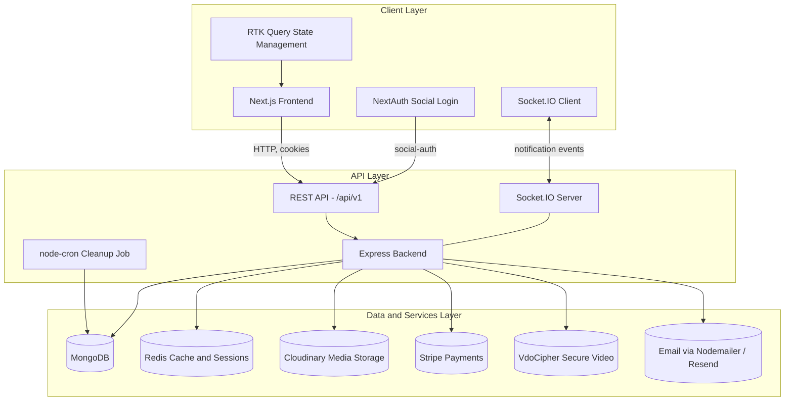
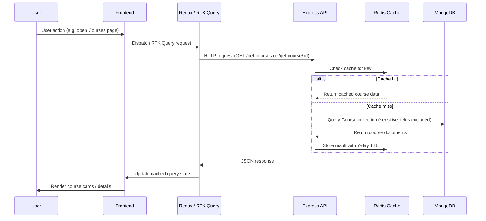
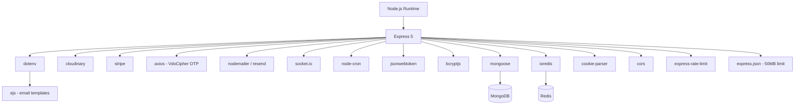
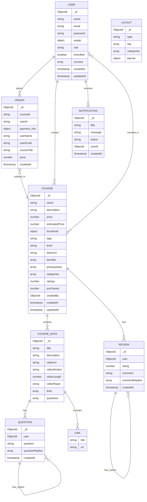
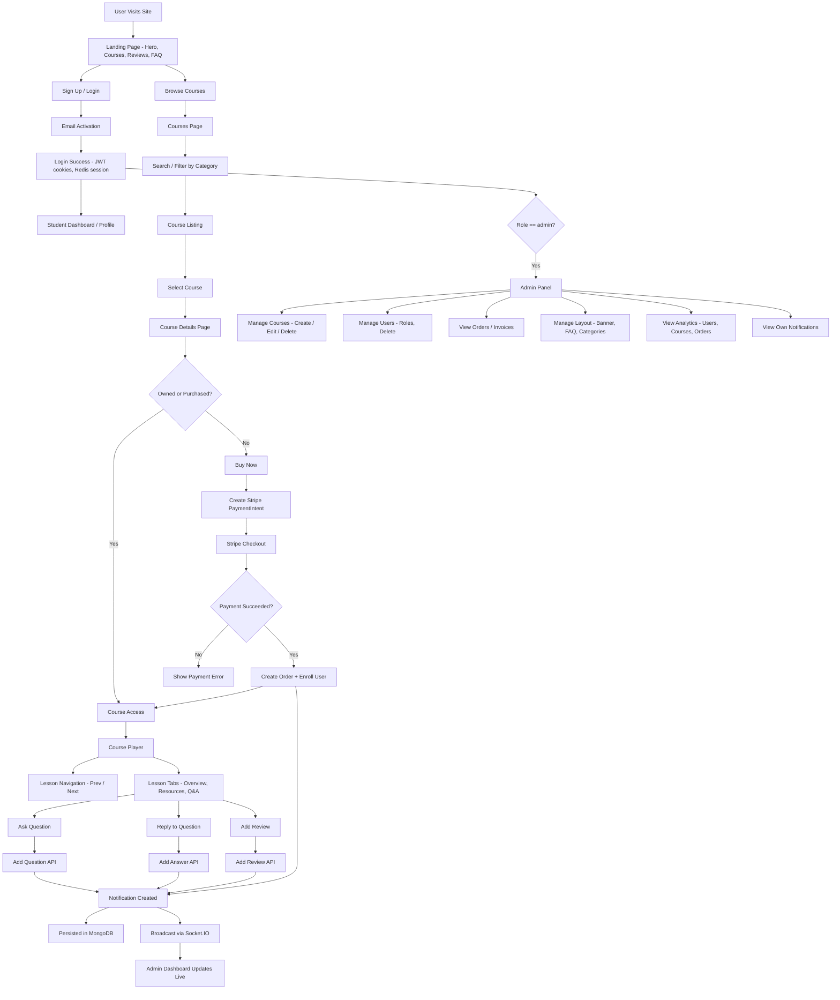
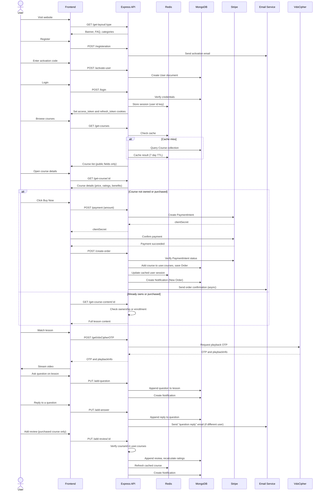
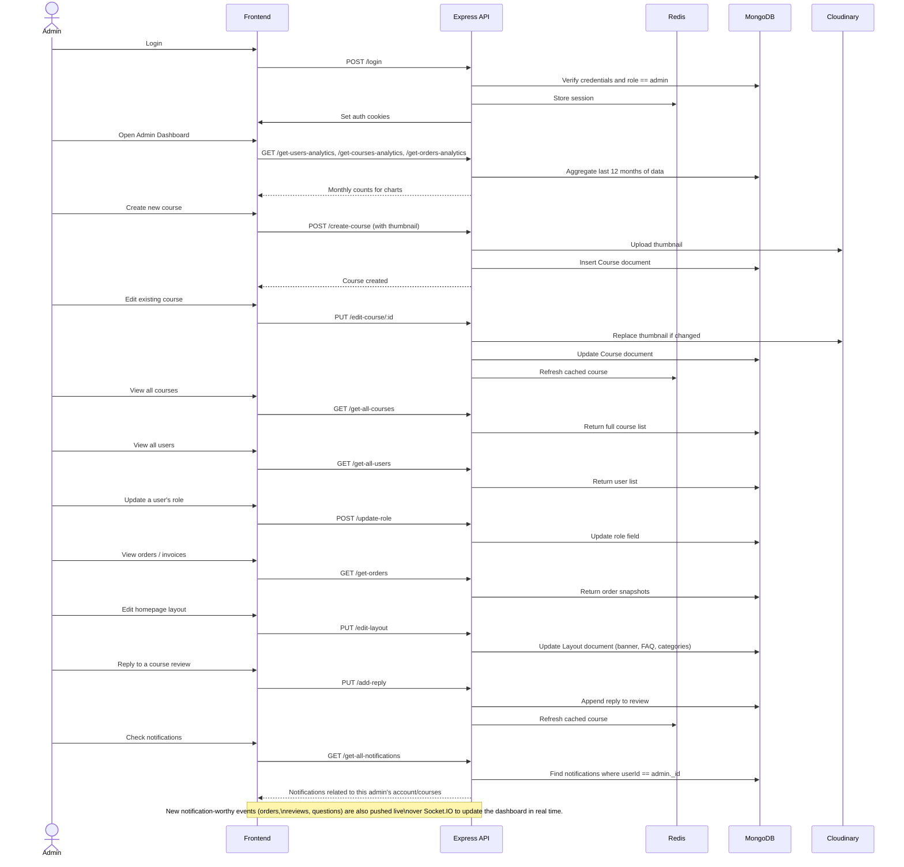

# Complete Case Study - SkillBridge LMS ([Live App](https://skillbridge-lms-app.vercel.app/))

## Overview

SkillBridge is a full-featured Learning Management System built with Next.js and TypeScript on the frontend, and Node.js with Express and TypeScript on the backend. The system exposes a set of RESTful APIs for managing online courses, user authentication, course enrollment, payment processing, content delivery and platform analytics. It follows a layered, modular architecture, where each business domain (users, courses, orders, notifications, analytics, layout) has its own routes, controllers and services, keeping routing, business logic and data access clearly separated.

The system is designed to support:

- Multi-role user management (Admin, Student/User roles)
- Course creation and content management with secure video streaming
- Secure payment processing via Stripe
- Interactive learning features such as questions, replies and reviews
- Administrative analytics and reporting
- Dynamic layout management for homepage content (banner, FAQ, categories)

## Project Goals

SkillBridge was built to be more than a simple course catalogue. The goal was to design a platform that mirrors how real online learning marketplaces work end to end, covering not just the "happy path" of browsing and watching a course, but the full lifecycle around it: account activation, role-based access, secure content gating, payments with verifiable server-side checks, real-time admin feedback, and a foundation for scaling into a true multi-vendor model where independent instructors can manage their own courses.

The core goals were:

- Build a realistic authentication system using access/refresh tokens and server-side session caching, not just a simple login form.
- Separate "public" course information from "protected" course content, so that lesson videos and resources are only ever returned to users who are entitled to see them.
- Make payments trustworthy by verifying Stripe PaymentIntents on the server before granting access, rather than trusting the client.
- Give administrators real operational tooling: user management, course management, order/invoice visibility, content management for the homepage, and growth analytics.
- Lay the groundwork for a multi-vendor model by modeling course ownership and an instructor role at the data layer from the start, even before the vendor-facing UI exists.

## System Architecture Overview

SkillBridge follows a three-tier architecture consisting of a Node.js/Express backend, a MongoDB database (with Redis as a supporting cache/session layer), and a Next.js frontend.

## System Architecture Diagram

## System Data Flow

This is the general read pattern used for course catalogue and course detail requests, where Redis sits in front of MongoDB as a cache.

Any write operation (course edit, new question, new answer, new review, reply to review) follows up with a Redis write to keep the cached copy of that course in sync, so the next read does not serve stale data.

## Key Features

### 1. Course Management

- Video-based lessons: each course contains a `courseData` array of lessons, each with its own title, description, video URL, video section, video length and resource links.
- Benefits and prerequisites: every course defines a list of learning outcomes and entry requirements shown on the course details page.
- Reviews and ratings: enrolled students can leave a 1-5 star rating with a written comment, and the course's average rating is recalculated automatically.
- Q&A per lesson: students can ask questions on a specific lesson, and replies are stored as a threaded list under that question.

### 2. Technical Features

- Real-time communication: Socket.IO connects the frontend to the backend for live notification delivery.
- Theme support: dark/light mode is available across the UI via a theme provider and theme switcher.
- Core homepage sections: hero banner, course carousel, reviews and FAQ, all driven dynamically by the Layout API so admins can edit them without a deployment.

### 3. Course Creation and Administration

- Multi-step course creation workflow: admins define the course name, description, pricing (with an optional estimated/original price), tags, categories, difficulty level, demo URL and thumbnail.
- Benefits and prerequisites: multiple entries can be added per course.
- Lesson content structure: each lesson includes a video URL, title, description, section label, length, and an arbitrary list of resource links.
- Full CRUD operations: admins can create, edit, view and delete courses through dedicated endpoints, with thumbnails uploaded to and removed from Cloudinary as needed.
- Course listing dashboard: a data grid view shows ratings, purchase counts, creation dates and edit/delete actions for every course.

### 4. Interactive Learning Features

- Q&A system: students post questions linked to a specific lesson; a notification record is created for the relevant user, and replies are appended as a threaded list under the original question.
- Review and rating system: students who have purchased a course can submit a review and rating; admins can reply to reviews, and the course's overall rating is recalculated as the average of all submitted ratings.

### 5. Student Learning Experience

- Video player and navigation: authenticated students who own or have purchased a course can stream its lessons, with previous/next controls between lessons.
- Tabbed lesson interface: overview, resource links and the Q&A thread are presented per lesson.
- Course discovery: category-based filtering and a searchable, responsive course catalogue.
- Dedicated course detail pages show full course information, reviews and ratings before purchase.

### 6. Payment and Enrollment

- Stripe integration: a PaymentIntent is created server-side for the course price, and the client completes payment using Stripe's hosted payment UI.
- Purchase verification: before an order is recorded, the server retrieves the PaymentIntent from Stripe and checks that its status is "succeeded".
- Enrollment tracking: a successful purchase adds the course id to the user's `courses` array, which is the same field used to gate access to lesson content.

### 7. Multi-Vendor Foundation

- Course ownership: every course stores a `createdBy` reference to the user who created it, and the course-content access check explicitly treats the creator as having full access regardless of purchase status.
- Instructor role: the User model's role enum already includes `instructor` alongside `user` and `admin`, so the data model supports a future state where instructors manage their own courses, with the admin role reserved for platform-wide operations.

### 8. Real-Time and Persistent Notifications

- New order notification: when a course is purchased, a notification record is created and an order confirmation email is sent asynchronously so it cannot delay the response to the buyer.
- New review notification: when a student adds a review, a notification record is created to flag the new feedback.
- Q&A notifications: new questions and new answers generate notification records, and a "question reply" email is sent to the original asker when someone else answers their question.
- Real-time delivery: in addition to being persisted in MongoDB, notification-worthy events are broadcast over Socket.IO so a connected admin dashboard can react immediately.
- Scoped visibility: notification retrieval is scoped to the requesting user's own id (`userId: req.user._id`), so an admin sees the notifications generated for their own account and their own courses rather than every notification on the platform. In the multi-vendor model this is exactly the behaviour an instructor would want: each instructor only sees activity (new questions, new reviews, new orders) related to the courses they themselves created, not the entire platform's notification stream.
- Automatic cleanup: a scheduled job removes notifications that are marked as read and older than 30 days, keeping the collection from growing without bound.

## Tech Stack

### Backend

- Node.js with Express 5, written in TypeScript and run with tsx in development
- MongoDB with Mongoose (v8) for data modeling
- JWT (jsonwebtoken) for access and refresh tokens
- bcryptjs for password hashing
- ioredis (Redis) for session storage and content caching
- Stripe for payment intents and checkout
- Cloudinary for image storage (avatars, thumbnails)
- Nodemailer with EJS templates, with Resend available as an alternative email provider
- Socket.IO for real-time notification delivery
- node-cron for scheduled notification cleanup
- express-rate-limit for basic API throttling
- axios for the VdoCipher secure video OTP integration

### Frontend

- Next.js (App Router) with React 19 and TypeScript
- Redux Toolkit and RTK Query for state and API management, split into per-domain API slices
- Tailwind CSS for styling, with Material UI and MUI X Data Grid for the admin dashboard
- Recharts for analytics charts
- NextAuth for social login (Google/GitHub)
- Stripe React components for the checkout experience
- Socket.IO client for real-time notification updates
- Formik and Yup for form handling and validation

### Deployment

- Frontend deployed on Vercel
- Backend (Express API and Socket.IO server) deployed on a Node hosting platform Render, connected to a managed MongoDB (e.g. Atlas) and a managed Redis instance

## Database Design

## Application Flow Diagram

## User Flow

## Admin Flow

## Security and Authentication Details

- Access tokens are signed with a roughly 5-minute expiry, and refresh tokens with a roughly 7-day expiry, both delivered as httpOnly cookies.
- On every protected request, the refresh token is used to re-issue both tokens and refresh the corresponding Redis session, so a logged-in user is not interrupted by a short access token lifetime.
- The active session (the serialized user document) is cached in Redis under the user's MongoDB id, so `isAuthenticated` does not need to hit MongoDB on every request.
- `authorizeRoles(...roles)` is a small middleware factory used to restrict routes such as course creation, user management, layout editing, analytics and order listing to the `admin` role.
- Passwords are hashed with bcryptjs in a pre-save hook before being persisted.
- CORS is restricted to a single configured origin, and a global rate limiter throttles repeated requests per IP.
- Stripe payments are verified server-side: an order is only created after the corresponding PaymentIntent is retrieved from Stripe and confirmed to have a "succeeded" status.

## Challenges and Solutions

| Challenge | Solution |
|---|---|
| Coordinating the order-creation flow so payment verification, enrollment, notification, course stats and email all happen reliably without one slow step blocking the user. | Restructured `createOrder` so the database writes (enrolling the user, recording the order, updating purchase count) complete first and the response is returned, while the order confirmation email is sent asynchronously afterwards so a slow mail provider cannot delay or break a purchase. |
| Keeping Redis cache entries for courses in sync after every mutation (edits, new questions, new answers, new reviews, new replies). | Added an explicit Redis `set` with a 7-day TTL after each course mutation, so the next read of that course reflects the change immediately instead of waiting for the cache to expire. |
| Deciding how much of a course's data should be visible to users who have not purchased it. | Used Mongoose field exclusion (`.select("-courseData.videoUrl -courseData.suggestion -courseData.questions -courseData.links")`) on the public course endpoints, so marketing details remain public while lesson content stays hidden until ownership or enrollment is verified. |
| Preventing duplicate purchases and unauthorized access to lesson content. | Centralized the check in two places: `createOrder` checks whether the course id already exists in `user.courses` before creating a new order, and `getCourseByUser` checks both course ownership (`createdBy`) and enrollment (`user.courses`) before returning lesson content. |
| Designing the data model so a single-admin platform today can become a multi-vendor platform later without a schema rewrite. | Added an `instructor` value to the user role enum and a `createdBy` reference on every course from the start, and built the course-content authorization check around ownership rather than role, so it already works correctly once instructors are allowed to create courses. |
| Managing a growing notifications collection. | Added a `node-cron` job that runs daily and deletes notifications that are both marked as read and older than 30 days. |

## Best Practices

### TypeScript Across the Stack

Both the frontend and backend are written in TypeScript, giving strong type safety across modules such as authentication, course management and order processing. Shared shapes like `IUser`, `ICourse` and `IOrder` are defined as interfaces alongside their Mongoose schemas, which catches mismatches between the data model and business logic at compile time rather than at runtime.

### Session-Based Authentication with Redis

Rather than relying purely on stateless JWTs, SkillBridge pairs short-lived access tokens with a server-side session cached in Redis. This combines the performance benefit of not hitting MongoDB on every request with the control benefit of being able to invalidate a session by deleting its Redis entry (used on logout and account deletion).

### Cache-Aware Data Access

Every endpoint that serves course data checks Redis first and falls back to MongoDB on a miss, and every mutation that changes a course refreshes its cache entry. This keeps the catalogue fast for the common case (repeated reads) while avoiding the classic problem of serving stale data after an edit.

### Ownership-Based Authorization for Content

Instead of hardcoding "admins can see everything, students can see what they bought," the course-content check is built around two general conditions: is this user the course's creator, or is this course in the user's enrolled list. This is a small design choice with a large payoff: it is the same rule that will let instructors access their own course content once the multi-vendor routes are opened up, with no changes needed to this check.

### Defensive Payment Handling

Payment success is never taken on the client's word. The server independently retrieves the PaymentIntent from Stripe and checks its status before creating an order, enrolling the user, or sending a confirmation email, which protects against tampered or replayed requests from the client.

## Conclusion

SkillBridge demonstrates a complete, role-aware Learning Management System: a Next.js and TypeScript frontend talking to a modular Express and TypeScript API, backed by MongoDB for persistent data, Redis for sessions and caching, Stripe for payments, Cloudinary for media, Socket.IO for real-time notifications, and a scheduled job for housekeeping. The architecture already separates public course information from protected lesson content, verifies payments server-side, gives administrators real tools for managing users, courses, content and growth, and models course ownership and an instructor role in a way that sets up a clear path toward a genuine multi-vendor marketplace.
